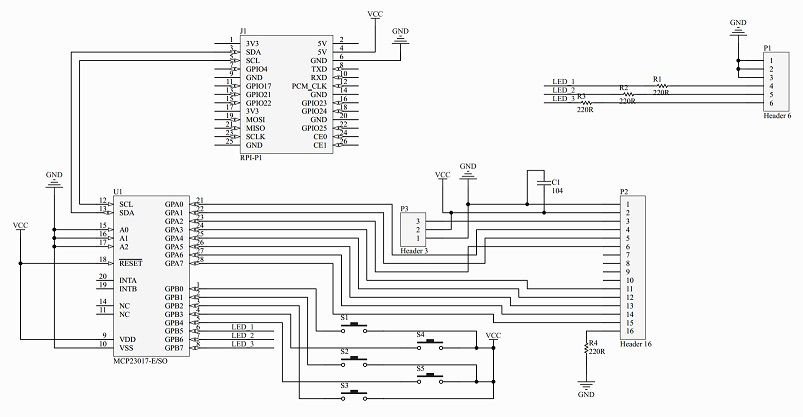

# Raspberry Pi RGB1602 LCD Module Examples and Documentation

Examples and Documentation for the RGB1602 LCD display by SeeedStudio

Seeed Studio product page: <https://www.seeedstudio.com/Raspberry-Pi-RGB1602-LCD-Module.html>

Product pages links to this wiki: https://wiki.52pi.com/index.php/52Pi-BPi_LCD_1602_Module_SKU:EP-0045 

Basically useless... Only provides a single example written in C which doesnt compile due to missing libraries.

For the example to work, follow instructions however install wiringPi from here: http://wiringpi.com/download-and-install/ instead of the git repo as the link in the example is broken. 

Also when compiling the example, instead of: 

`sudo gcc mylcd1602.c /home/pi/wiringPi/devLib/lcd.o -lwiringPi -o mylcd1602`

Use:

` sudo gcc mylcd1602.c -lwiringPi -lwiringPiDev -o mylcd1602`

The compile command given was missing the `-lwiringPiDev` library required.

When Googling random snippets from the C example on the product's wiki, I found this:

<http://wiki.banana-pi.org/BPI_LCD_1602_display_module>

Which is an identically designed RGB1602 display but actually has some info regarding the design. Might be useful as it gives more information about the pin out of the GPIO.



I found another example in C which has some comments written in Chinese <http://forum.banana-pi.org/t/banana-pi-accessories-bpi-lcd1602-module-and-how-to-use/331>

Ive included the code snippet below with the English translation from Google Translate below:
```
#include <stdio.h>                                                                        
#include <wiringPi.h>                                                             
#include <mcp23017.h>                                                          //将wiringPI中提供的MCP23017的库包含到程序中     //Include the MCP23017 library provided in wiringPI into the program
#include <lcd.h>                                                               //将wirongPi中提供的LCD驱动库包含到程序中        //Include the LCD driver library provided in WirongPi into the program
 
int main()
{
        int display,i,count;                                                       //定义几个等下需要使用的变凉     //Define a few cools that need to be used later
        wiringPiSetup();                                                           //初始化wiringPi     //Initialize wiringPi

        mcp23017Setup (100, 0x20);                                                 //初始化MCP23017芯片，IO口起始编号为100，I2C地址为0x20       //Initialize the MCP23017 chip, the starting number of the IO port is 100, and the I2C address is 0x20
        printf ("Banana pi - MCP23017 Test\n");
        for(i=0;i<16;i++)
          pinMode(100+i,OUTPUT);                                                   //将拓展出的IO口全部置为输出模式     //Set all the expanded IO ports to output mode
        digitalWrite(107,1);                                                       //将107引脚置为高电平，点亮LCD背光灯     //Set pin 107 to high level to light up the LCD backlight
        digitalWrite(101,0);                                                       //将R/W置为低电平，将LCD设置为写入状态       //Set R/W to low level, set LCD to write state
        display=lcdInit(2,16,4,100,102,103,104,105,106,0,0,0,0);                   //初始化LCD屏幕      //Initialize the LCD screen
        lcdHome(display);                                                          //将LCD的光标归位        //Return the LCD cursor
        lcdClear(display);                                                               //清屏     //Clear screen
        lcdPosition(display,0,0);                                                  //设置LCD屏幕显示初始位置        //Set the initial position of the LCD screen
        lcdPuts(display,"Hello World");                                            //在屏幕上显示“Hello World”      //Show "Hello World" on the screen

        while(1)
        {
                lcdPosition(display,0,1);                                                                                              
                lcdPrintf(display,"%d",count++);                                       //自动循环加1        //Automatic cycle plus 1
                delay(300);                                                            //延时300毫秒        //Delay 300 milliseconds
                printf("lcd1602\n");
        }
}
```
